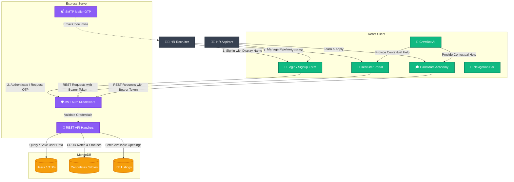

# 🎓 Crewcore HR
> **AI-Driven Recruiting Hub & HR Learning Academy**

Crewcore HR is a premium, modern HR management system and educational portal built to bridge the gap between HR Recruiter management and HR Candidate learning. With a gorgeous glassmorphic UI, a context-aware floating AI Copilot, and full MongoDB-powered data persistence, it serves as a dual-facing hub for HR processes.

---

## 🗺️ System Architecture



---

## ✨ Features

### 🏢 Recruiter Dashboard
- **Applicants Tracker:** Manage applicant pipelines (Applied, Interviewing, Hired, Rejected) with real-time updates.
- **AI-Powered Screening:** Automatic AI fit scores, summary generation, and strength/weakness evaluations for candidate resumes.
- **Curriculum & Notes:** Centralized notes database to keep comments, strategies, and interview logs organized.

### 🎒 HR Aspirant Academy
- **Interactive Scenarios:** Practice real-world HR dilemmas with simulated training scenarios and instant feedback.
- **Job Board & Application:** Browse curated HR listings, upload resumes, and answer dynamic screening questions.
- **Display Name Control:** Choose your custom workspace username directly from the login page.

### 🤖 CrewBot AI Copilot
- Context-aware floating helper that reacts dynamically based on whether you are logged in as a candidate or a recruiter.
- Helps autofill job descriptions, generate screening templates, and launch training paths.

---

## 🛠️ Technology Stack

| Layer | Technologies |
|---|---|
| **Frontend** | React, TypeScript, Vite, Lucide Icons |
| **Backend** | Node.js, Express, Nodemailer (SMTP OTP Delivery) |
| **Database** | MongoDB, Mongoose |
| **Styling** | Custom Glassmorphic CSS Engine, Theme Sync (Classic / Monochrome) |

---

## 🚀 Getting Started

### 📋 Prerequisites
Ensure you have the following installed on your system:
- [Node.js](https://nodejs.org/) (v16.0 or higher)
- [MongoDB](https://www.mongodb.com/) (Local database or MongoDB Atlas URI)

### 📂 Repository Structure
```bash
Crewcore/
├── src/                # React Frontend Source Code
│   ├── components/     # Reusable components (Navbar, AiBot, etc.)
│   ├── pages/          # Primary Pages (Login, CandidatePortal, RecruiterPortal)
│   └── main.tsx        # React entrypoint
├── server/             # Express.js Backend Server
│   ├── server.js       # Database models, API routes, and Nodemailer integration
│   └── mailer.js       # SMTP helper configuration
├── package.json        # Frontend & toolchain dependencies
└── .env                # Local environment secrets configuration
```

### ⚙️ Environment Configuration
Create a `.env` file in the root directory:
```env
PORT=5000
MONGODB_URI=mongodb://127.5.5.1:27017/crewcore
JWT_SECRET=your_jwt_signing_secret_key_here
SMTP_USER=your_verified_smtp_email@gmail.com
SMTP_PASS=your_smtp_app_password_here
```

### ⚡ Running Locally

1. **Install Dependencies:**
   ```bash
   npm install
   ```

2. **Start the Express Server:**
   ```bash
   node server/server.js
   ```

3. **Start the Vite Dev Client:**
   ```bash
   npm run dev
   ```

Open [http://localhost:5173/](http://localhost:5173/) in your browser to explore Crewcore HR!
